# ft_shield
This document explain the objective, features design, procedure of the ft_shield trojan.

> Disclaimer: this project is for educational purposes only

## Installation
For MacOS users, `binutils` and `libelf` needs to be installed manually to build this project

TODO: change the IP addresses accordingly

[DEVELOP.md](./DEVELOP.md)

## Objective
The objective of this program is to spawn a service which executes a remote shell in the victims machine in the background by exposing a port, allowing for remote attackers to connect to the victims machine and execute the said shell program

## Design
TODO: diagram here

## Features
- packing without compression
- disguising via payload binary placement
- disguising via service name change
- background service
- auth mechanism

## How it works
When the trojan is configured, shellcode is generated, packed and injected into an [empty spot within the trojan](https://en.wikipedia.org/wiki/Code_cave).

Upon running the program it simply prints out our user id, but in the background it creates a binary at a semi hidden location and creates a systemd service so it spins up at launch.

The payload exposes port `4242` which the attacker can connect to and execute commands on the victim's machine.

## [The Injector](./ft_shield/main.c)
- Copies the payload binary stored within itself from the shellcode injection to `/var/mail` as it requires sudo access and isn't checked frequently.

- Creates the service for the payload to run on startup.

- Runs the ["legit"](./ft_shield/legit/legit.c) part of the trojan.

## [The Payload](./ft_shield/payload/)
- When ran will rerun itself with a different name via `execv`, this obfuscates itself when the machine is inspected using tools like `ps aux` or `htop`. The service itself was intentionally not obfuscated for the purpose of this project.

- [Generates a random password](./ft_shield/payload/key/key.c) and exfiltrates it to a [*cloud server*](./local_cloud.py).

- Spins up the [server](./ft_shield/payload/server/server.c) exposing port `4242`. Up to 3 clients can connect to the server at any given time.

- Clients can run several commands such as I/O Monitoring, a virtual shell, and bidirectional file transfering.
